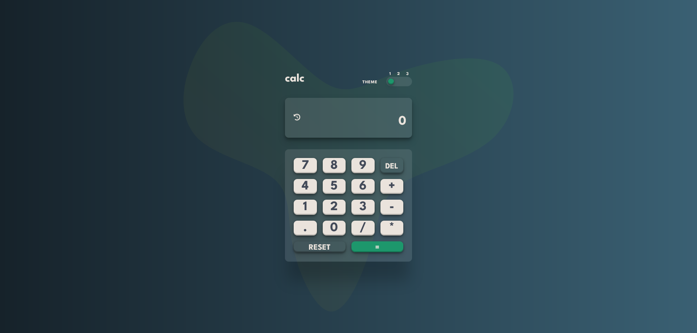

# calculator-javascript

## Table of contents

- [Overview](#overview)
  - [Screenshot](#screenshot)
  - [Features](#features)
  - [Links](#links)
- [My process](#my-process)
  - [Built with](#built-with)
  - [Implementation](#implementation)
  - [Continued development](#continued-development)
  - [Useful resources](#useful-resources)
- [Author](#author)

## Overview

### Screenshot

### Links

- [Live Site Demo](https://calculator-javascript-654.netlify.app/)
- [Code Repository](https://github.com/MariusHor/calculator-javascript)

### Features

- Basic arithmetic operations (addition, subtraction, multiplication, division)
- Switch between 3 different themes
- History of the last 5 calculations
- Responsive design

## My process

### Built with

- Semantic HTML5 markup
- SCSS
- JavaScript
- Webpack

### Implementation 

This is a vanilla JavaScript calculator app that allows users to switch between 3 nice-looking themes, provides basic arithmetic operations, and provides the ability to see a history of the last 5 calculations performed. The app is written in an MV* variation architecture, implements a PubSub class to manage communication of data from the Model to the listening views whenever the state changes. A HistoryManager class is also included to handle the history logic of the performed calculations and is separated from the Model class for better separation of concerns.

### Continued development

In future developments, I would like to add more complex operations and advanced functionalities to the calculator, such as the ability to calculate percentages, square roots, and exponents.

### Useful resources

- [MDN Web Docs](https://developer.mozilla.org/en-US/)
- [Webpack Documentation](https://webpack.js.org/concepts/)
- [JavaScript.info](https://javascript.info/)

## Author

- Github - [@MariusHor](https://github.com/MariusHor/)
- Frontend Mentor - [@MariusHor](https://www.frontendmentor.io/profile/MariusHor)r
